# VnHub

A modern visual novel library manager for Windows. Organize your collection, track
reading progress and play time, pull rich metadata from multiple providers, and make
the interface your own.

<p>
  
  
  
  
</p>

## Overview

VnHub is a native Windows desktop application built on .NET 8 and WebView2. The C#
backend handles data, files, and integrations, while the UI is a self-contained web
front end (HTML / CSS / JavaScript) communicating through a lightweight message bridge.

<details>
<summary><strong>Features</strong></summary>

### Library
- Organize visual novels with custom **groups** and **tags**
- Mark entries as **favorite** or **priority (pinned)**
- Track **status** — Reading, Completed, On Hold, Dropped, Plan to Read
- **Reading progress** and per-title / category **ratings**
- Fast **search**, sorting, filtering, and adjustable grid / list views

### Metadata
- Fetch covers and details from multiple providers:
  **VNDB**, **IGDB**, **RAWG**, **AniList**, **Bangumi**, and **Steam**
- Per-entry metadata refresh and manual overrides
- Custom links and notes for each title

### Tracking
- Automatic **play-time** and **session** tracking on launch
- **Statistics** dashboard with play history and achievements
- Launch games directly and monitor running titles

### Library Tools
- **Folder scanning** to bulk-import executables
- **Backup** and restore of your library
- **Export** to JSON, CSV, and HTML

### Customization
- Custom fonts, background images (app / sidebar / topbar), and accent colors
- Adjustable layout — sidebar width, card radius, surface opacity
- Light and dark themes
- Localized in **English**, **Russian**, and **Japanese**
- System tray support and configurable keyboard shortcuts

</details>

## Screenshots

<details>
<summary><strong>Library & Reading</strong></summary>

**Library** — browse your collection with cover cards, status badges, and quick filters.

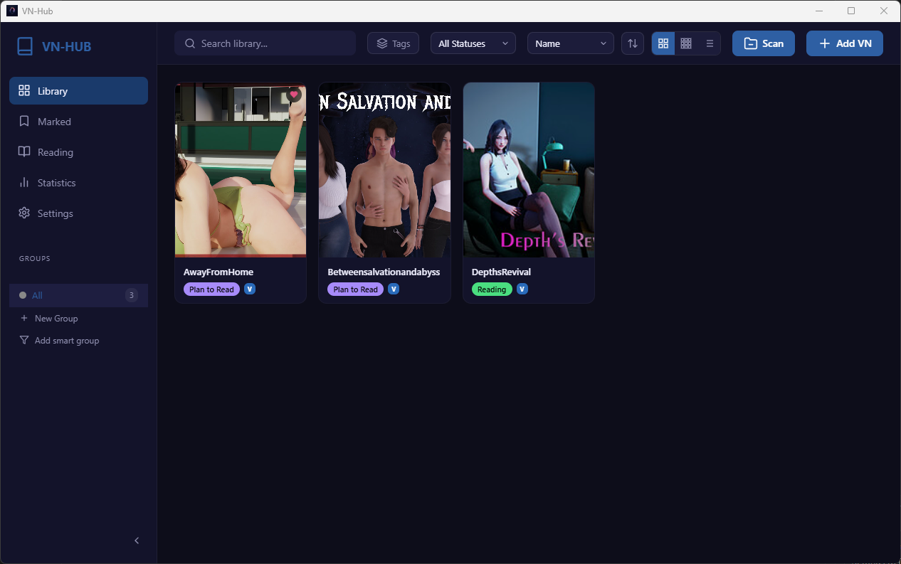

**Marked** — entries flagged as favorite or priority in one place.

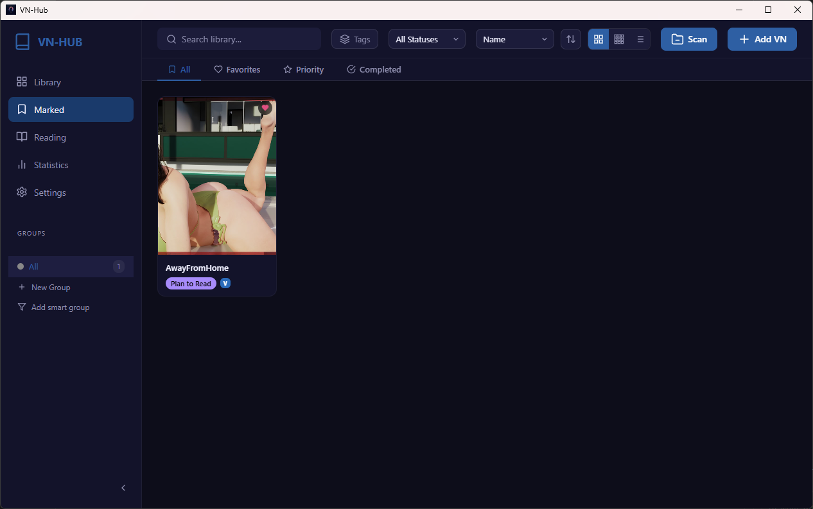

**Reading** — titles currently in progress, grouped by session state.

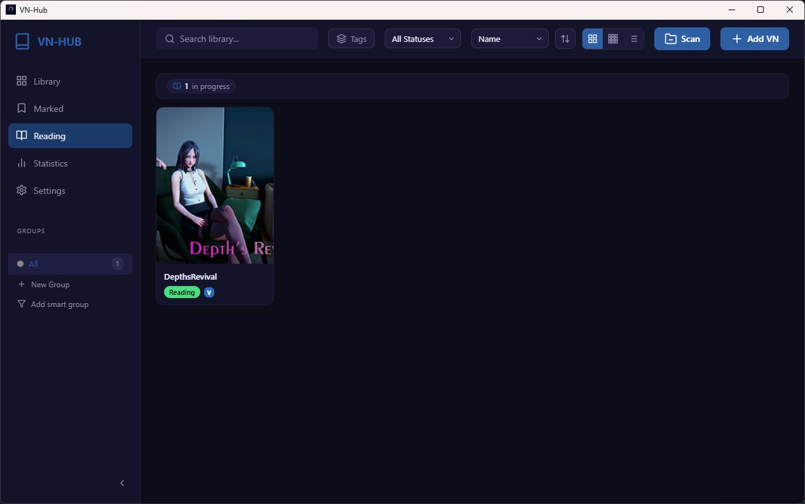

</details>

<details>
<summary><strong>Statistics</strong></summary>

**Overview** — play-time totals, streaks, ratings, and an activity heatmap.

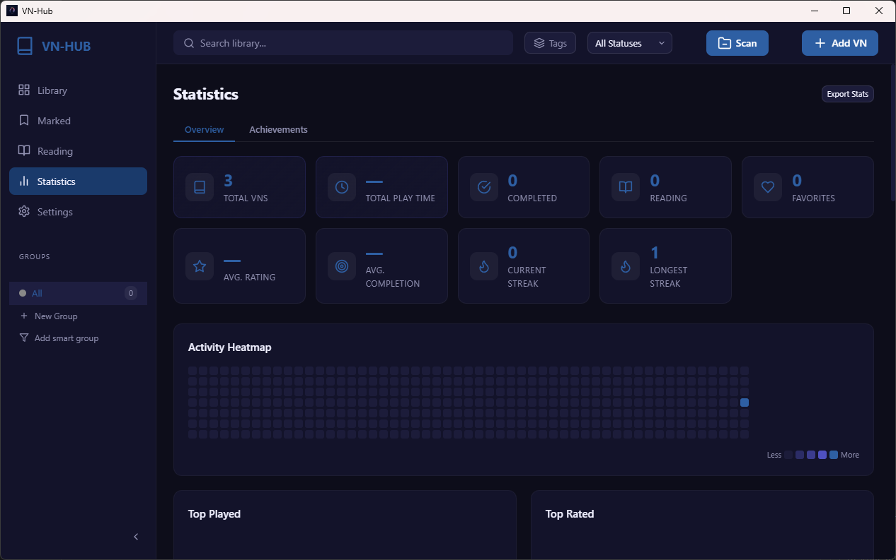

**Achievements** — milestone tracker showing unlocked and in-progress achievements.

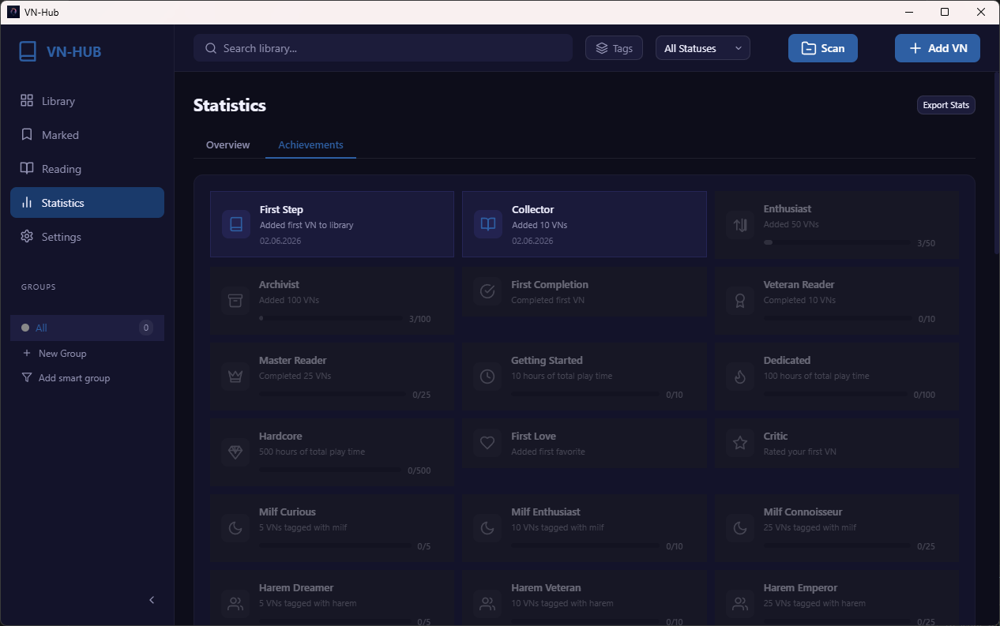

</details>

<details>
<summary><strong>Settings</strong></summary>

**General** — theme, language, and system tray options.

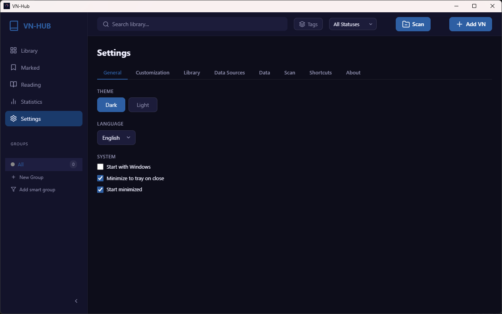

**Customization** — colors, surface opacity, sidebar width, corner radius, and status palette.

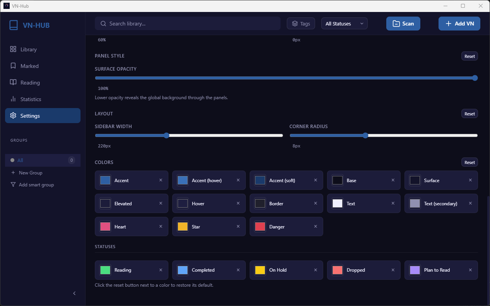

**Library** — default folder, JSON export / import, CSV and HTML export.

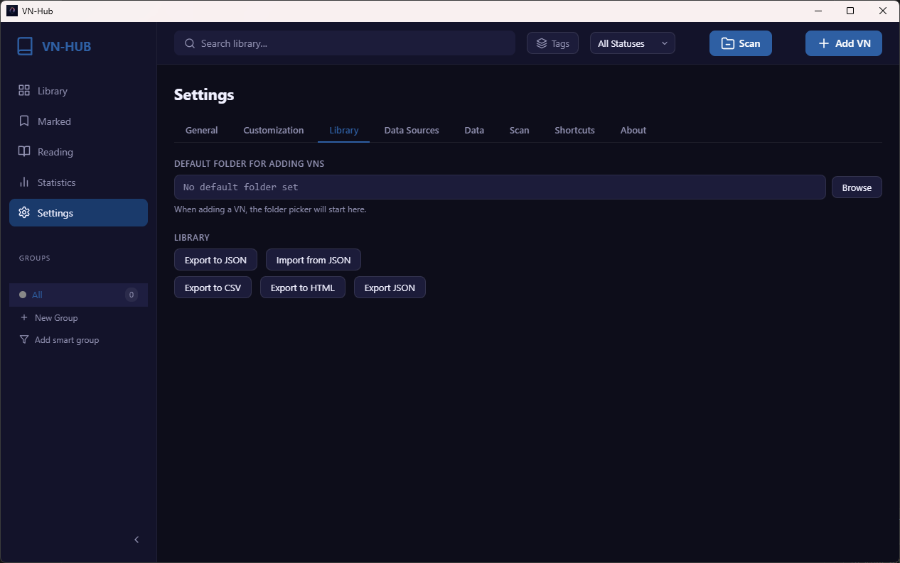

**Data Sources** — metadata provider selection and API credentials.

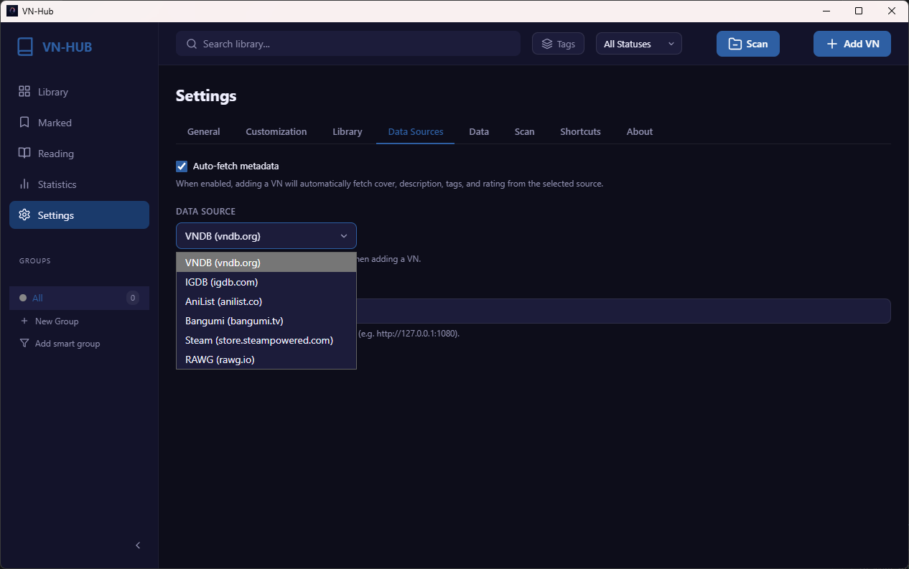

**Data** — database and covers location, backup management and scheduling.

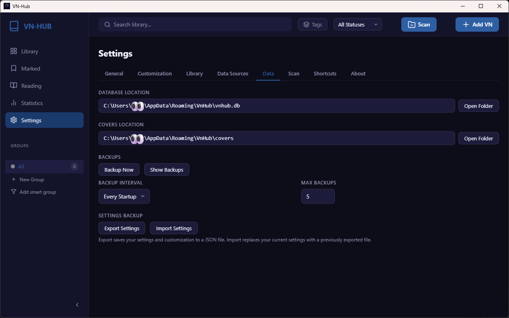

**Scan** — executable and directory blacklists, sort order, and scan options.

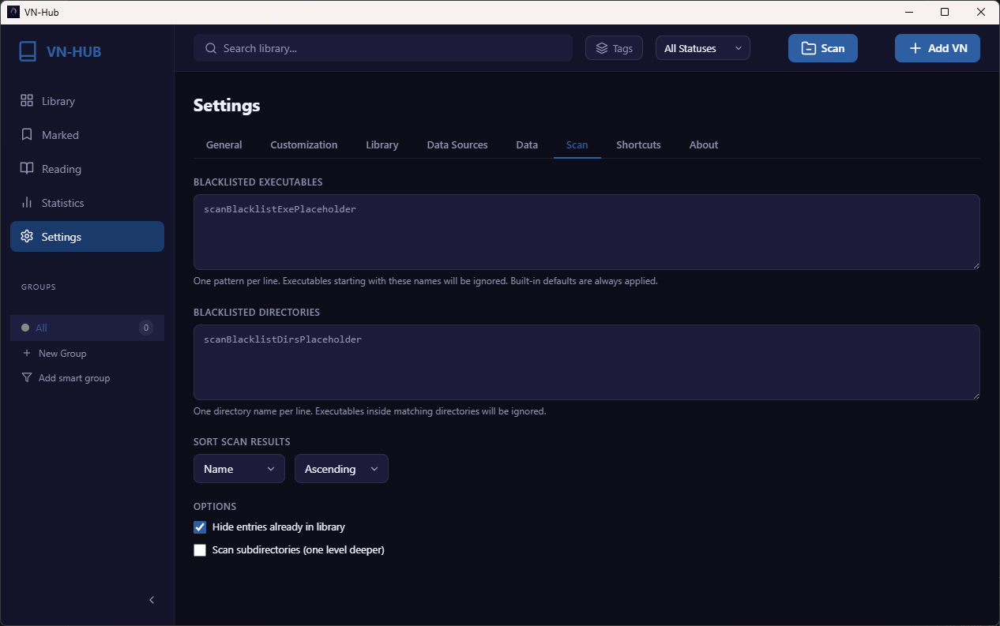

**Shortcuts** — rebindable keyboard shortcuts.

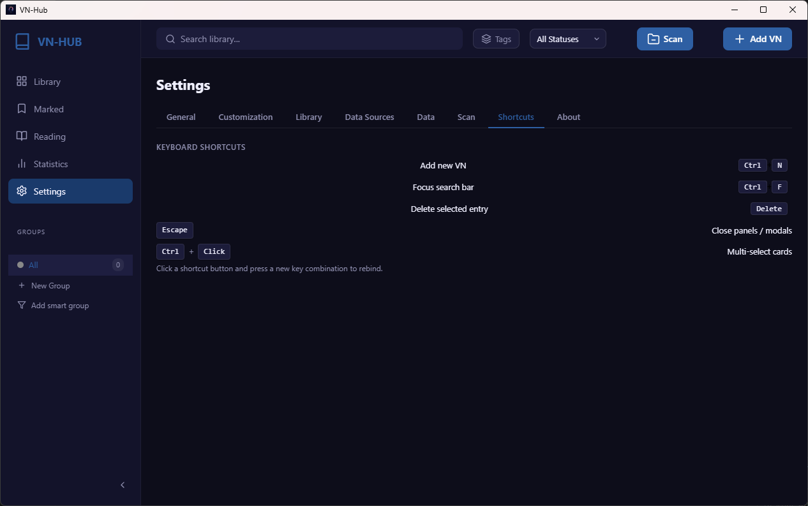

**About** — version info, log viewer, and danger-zone actions.

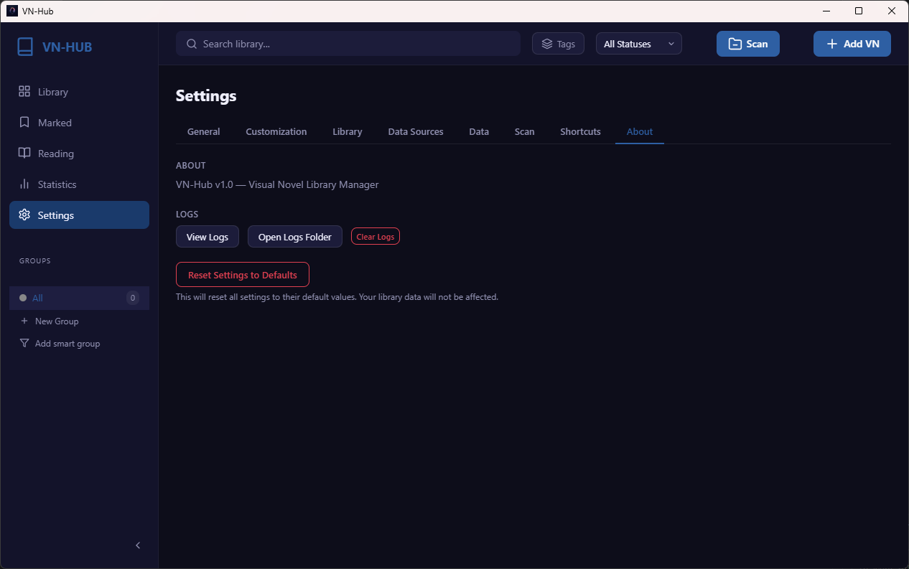

</details>

## Technology Stack

| Layer        | Technology                                  |
| ------------ | ------------------------------------------- |
| Language     | C# (.NET 8.0)                               |
| Desktop host | Windows Forms + WebView2                    |
| Front end    | HTML5, CSS3, JavaScript                     |
| Database     | SQLite (`Microsoft.Data.Sqlite`)            |
| DI           | `Microsoft.Extensions.DependencyInjection`  |

## Getting Started

### Prerequisites

- Windows 10 / 11 (x64)
- [.NET 8.0 SDK](https://dotnet.microsoft.com/download/dotnet/8.0)
- [WebView2 Runtime](https://developer.microsoft.com/microsoft-edge/webview2/)
  (preinstalled on most up-to-date Windows systems)

### Build & Run

```bash
git clone https://github.com/gqwg2003/VN-Hub.git
cd VN-Hub
dotnet run
```

### Create an Installer

An [Inno Setup](https://jrsoftware.org/isinfo.php) script is included.

```bash
dotnet publish -c Release -r win-x64 -o publish/win-x64
# then compile installer.iss with Inno Setup
```

The output installer is written to the `installer/` directory.

## Project Structure

```
src/
├── UI/             Web-based user interface
│   ├── css/        Styles (shared + per-view)
│   ├── js/         Application logic and bridge
│   └── partials/   HTML fragments loaded at runtime
├── Database/       Data access (repositories, SQLite)
├── Services/       Business logic and metadata providers
├── Handlers/       Bridge message handlers
├── Models/         Data models
└── Common/         Shared utilities and validation
```

## Architecture

```
JavaScript (UI)  ──postMessage──>  Bridge.cs  ──>  Handlers  ──>  Services  ──>  Database
       ^                                                                            │
       └────────────────────────  callbacks (JSON)  ───────────────────────────────┘
```

The UI sends `{ action, payload }` messages to the native host. `Bridge.cs` routes
each action to a handler, which delegates to the appropriate service. Results are
returned to the UI as named callbacks.

## License

GNU General Public License v3.0

## Author

**gqwg2003** — [github.com/gqwg2003/VN-Hub](https://github.com/gqwg2003/VN-Hub)
